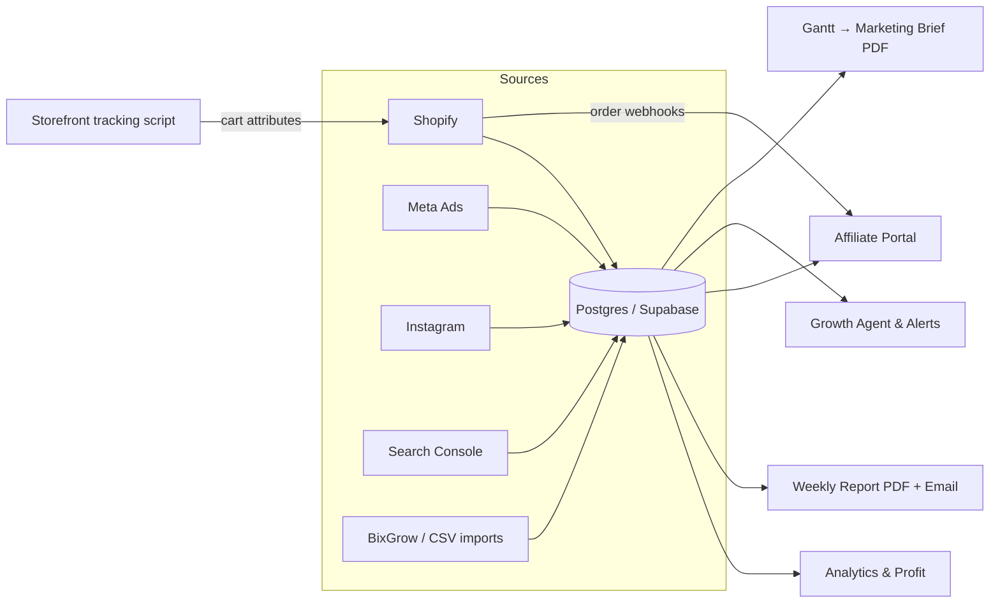

# Brandzp Analytics — Project Overview & Production Readiness

*Updated: 2026-07-29 · Repo: `shopify-profit-ops-system` · First tenant: Incense Parfums*

## What this project is

A **multi-tenant SaaS growth command center for Shopify brands**. It syncs a store's commerce and marketing data (Shopify orders/products/customers, Meta Ads, Instagram, Google Search Console) into its own Postgres database, and turns it into: profit analytics, a proactive weekly growth report (PDF + email), an affiliate program manager with real attribution, a marketing calendar (Gantt) that generates the team's monthly brief, and an AI growth agent that surfaces red flags and prescribes actions.

The product direction ("Command Center") is to collapse ~12 separate surfaces into one weekly growth brain for the store owner: every report should *surface* problems and *prescribe* the next action, not just describe data — and every resolved alert gets its outcome measured days later and reported back ("✅ X worked / ❌ Y didn't").

## Architecture

| Layer | Technology |
|---|---|
| Web app | Next.js 15 (App Router) + React 19, Tailwind, Recharts |
| Database | PostgreSQL (Supabase) via Prisma 6 — 42 tables, multi-tenant scoped by `storeId`/org |
| Auth | Supabase Auth + organizations (multi-tenant), route guards (`assertStoreInActiveOrg`) |
| Shopify | OAuth Partner app (or pasted Admin token), GraphQL Admin API, order webhooks (HMAC-verified) |
| Sync | 2-hour cron (`/api/cron/refresh-all`): Shopify → Meta Ads → Instagram → GSC per store, plus affiliate reconcile + backfill |
| AI | Brandzp BI Gateway (internal LLM router) for briefs/commentary, Anthropic as fallback |
| PDF | Print pages rendered by Playwright/Chromium — the print page is the single render surface for all PDF paths |
| Email | Resend (weekly report delivery, notifications) |
| Creative | Replicate (Flux) image generation for the Creative studio |
| Hosting | Render (blueprint in `render.yaml`), auto-deploy from `main` |

## Modules & features

### 1. Analytics & profit
Dashboard with revenue/orders/refunds, profit & contribution-margin analysis (product costs, discounts, refunds, ad spend), sales summaries, and offline-sales Excel import for blending non-Shopify revenue. Data refreshes every 2 hours; a manual sync is available.

### 2. Weekly growth report
The flagship deliverable: a weekly PDF (rendered from a single print page) with BI commentary, red-flag surfacing, and prescribed actions — delivered by email. Includes Meta Ads weekly print and the closed-loop decision ledger (alert outcomes measured 3–7 days later and reported back).

### 3. Affiliate portal (8 tabs)
Full affiliate program management: directory (add/import/export affiliates with Instagram profiles), **coupon creation directly in Shopify** (single + bulk, products/collections/segments scoping, apply-links), conversions ledger, payouts workflow (approve → mark paid, per-status balances), programs, and settings. Attribution works three ways, all reconciled into one ledger:
- **Link tracking**: `?ref=CODE` → storefront script → cart attributes → order webhook
- **Coupon matching**: order discount codes matched to affiliate codes/coupons (exact match only)
- **Imports**: BixGrow webhook + CSV import of historical conversions from the previous platform

Commission honors per-affiliate overrides → program rate → 10% default. A 2-hour backfill + orphan reconciler catch anything the webhook missed (create-only — it never overwrites real commission data).

### 4. Marketing planner — Gantt studio
Upload the team's Excel marketing calendar (Israeli calendar-matrix format or tabular; Hebrew + English). The parser classifies every task (discount, banner, video, post, email, SMS, web); the studio shows per-role views and generates the **monthly marketing brief** (the team's exact format: permanent offers, influencer campaigns, site discounts, paid promotion, UGC) as a Hebrew RTL PDF, per-role PDFs, and a customer-service discount sheet. New: a **discount audit** on every brief — flags duplicate coupon codes, codes colliding with existing affiliate codes, and mechanics that need special setup on a standard (non-Plus) Shopify plan, with per-offer guidance (e.g. gift-with-purchase → Buy X Get Y).

### 5. Growth agent & alerts
Configurable agent (thresholds, comparison windows, guardrails, approval rules) that scans synced data for findings and feeds the alert/command-center flow. Restock-of-hero alerting is the canonical planned pattern (hero product back in stock → banner + email + named action).

### 6. Creative studio
AI image generation (Replicate/Flux) for campaign creatives with project organization and local/S3/R2 storage.

### 7. Platform
Onboarding wizard, setup-health checks, store switcher (org-scoped), Shopify connection manager (OAuth or token with scope validation), settings, security/privacy/terms pages, notification service. Billing scaffolding present (Stripe SDK).

## Current status (honest assessment)

### Verified green
- **Build**: production build passes — 82 pages. **Typecheck**: clean. **Unit tests**: 51/51 pass (`npm test`, zero extra dependencies).
- **Affiliate module**: fully audited end-to-end this month (multi-agent code review, 15 findings — all fixed), covering webhook attribution, auth/tenant guards on all routes, OAuth scopes, open-redirect hardening, CSV round-trips, and the storefront script. Deployed to production and confirmed live (webhook is attributing real orders).
- **Production data audited** (read-only, 2026-07-28): schema fully migrated; ~19.3k attribution rows across 74 affiliates are legitimate (historical imports verified — commission ratios are real, no corruption); no duplicate codes; no clobbered commissions.
- **Gantt discounts**: extractor + audit shipped with 15 dedicated tests.

### Open items before "production-verified" (the go-live checklist)
1. **Verify Render env**: `SHOPIFY_OAUTH_SCOPES` must include `write_discounts` (render.yaml sets it, but only auto-applies for Blueprint services — check the dashboard).
2. **Re-run OAuth install once as the store owner** — grants `write_discounts`; coupon creation fails until then.
3. **Verify the 2-hour cron is firing** (`/api/cron/refresh-all` with `x-cron-secret`). Evidence suggests it may not be: 533 fresh webhook attributions are waiting to be linked to their orders, which the cron reconciler should have done.
4. **Theme snippet + metafield on the live store** — paste `docs/shopify-theme-affiliate-ref-snippet.liquid` into `theme.liquid` before `</body>`, create shop metafield `custom.growth_agent_app_url` = production APP_URL. Link tracking is inactive until this is done.
5. **Data repair (2 minutes)**: run `node tmp_fix_cross_member_dups.cjs` against prod (dry-run, then `--apply`) — removes 21 zero-commission double-credited rows.
6. **Business decision**: all 19,329 conversions are `unpaid`. Pick a cutoff date ("everything before X was settled on the old platform") to bulk-mark historical rows paid, so the payout queue shows real debt.

### Known gaps (tracked, not blockers)
- Affiliate **Programs page is read-only** — no UI to create a program or set commission rate (rate changes require DB edit). Conversions tab shows a hardcoded "approved" status while Payouts shows the real one.
- **BixGrow webhook has no HMAC** — the URL slug is the only protection.
- App **chrome/header still resolves "globally newest store"** — cosmetic in single-tenant, must be fixed before onboarding a second tenant.
- Affiliate trend chart plots clicks on the sales axis; tooltip labels are Hebrew-only in English mode.
- Click counts stay 0 (the redirect/click-tracking link builder is unwired; real links go straight to the storefront).
- ESLint is not configured (`next lint` is deprecated and was never set up).
- `DiscountUsage` is only synced for ~5% of historical orders (fine going forward; old orders can't be coupon-re-verified).

## QA plan

House rule: use live UI checks (Playwright) — confirm pages actually render, don't assume. For each area record **PASS/FAIL + evidence** (screenshot, console snippet, or URL); file confirmed defects to `tasks/bugs.md` with severity and `file:line`.

### Per-page baseline (every surface)
- [ ] Page returns 200, renders without console errors, no broken images/overlap.
- [ ] Mobile / tablet / desktop breakpoints intact.
- [ ] **RTL correct** (Hebrew surfaces): text alignment, mirrored icons, no clipped content.
- [ ] Empty states render sanely on a fresh store (no crashes on zero data).

### Critical flows to test end-to-end (priority order)
1. **Affiliate attribution (the money path)**: create affiliate → create coupon (verify it appears in Shopify admin) → open `https://SHOP/?ref=CODE` incognito → place test order (with and without the coupon) → conversion appears in portal (seconds via webhook; ≤2h via cron) → totals update → approve → mark paid → balances move correctly.
2. **Weekly report**: generate → PDF renders (Hebrew RTL correct) → email delivers → numbers match the dashboard for the same period.
3. **Gantt → brief**: upload the real monthly Excel → rows parse (spot-check ~10 cells incl. merged cells and Hebrew) → brief generates → discount audit callouts appear where expected → per-role PDFs + customer-service sheet export.
4. **Sync integrity**: trigger manual sync → order/refund counts match Shopify admin for the same window; cron tick visible in logs.
5. **Onboarding**: fresh org signup → connect store via OAuth → setup-health reflects reality → dashboard populates after first sync.
6. **Auth boundaries**: signed-out user hits every portal/API surface → redirected/401; user from org A cannot read or write org B data (spot-check affiliates, conversions, exports).
7. **CSV round-trips**: affiliate export → re-import → no data corruption; conversions import (BixGrow format) → rows + totals correct.
8. **Coupon guardrails**: creating a coupon with an existing affiliate's code → clear error, not silent overwrite; bulk creation scoping (products/collections) matches what Shopify shows.

### Regression list (recently fixed — must not reappear)
- Order webhook 500s on attributed orders · double-counted member totals · commission overwritten to flat 10% · substring false-attributions ("ANA" matching "BANANA10") · affiliate CSV column shift · cart note overwritten on storefront · open redirect via `?destination=` · unauthenticated coupon creation · cross-tenant exports.

## Bottom line

The codebase builds clean, is unit-tested on its riskiest logic, the highest-risk module (affiliate money path) has been audited at code *and* data level, and production is already running the fixes. What separates today from "production-verified" is not code: it's the 6-item go-live checklist above — roughly one hour of dashboard/Shopify clicks plus one QA pass over the critical flows.
